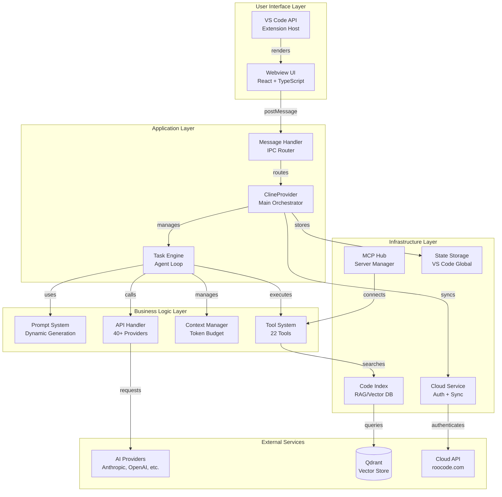

# Roo Code System Architecture Documentation

> **Version**: 1.0
> **Date**: 2025-11-15
> **Status**: Comprehensive Analysis Complete
> **Maintainer**: Architecture Team

---

## Table of Contents

1. [Executive Summary](#executive-summary)
2. [System Overview](#system-overview)
3. [Architecture Layers](#architecture-layers)
4. [Core Components](#core-components)
5. [Data Flow](#data-flow)
6. [Integration Architecture](#integration-architecture)
7. [Technology Stack](#technology-stack)
8. [Design Patterns](#design-patterns)
9. [Scalability & Performance](#scalability--performance)
10. [Security Architecture](#security-architecture)
11. [Deployment Architecture](#deployment-architecture)
12. [Development Architecture](#development-architecture)

---

## Executive Summary

### What is Roo Code?

Roo Code is an **AI-powered development assistant** that operates as a VS Code extension, providing autonomous coding capabilities through a sophisticated agent-based architecture. It combines:

- **40+ AI Provider Integrations** (Anthropic, OpenAI, Gemini, etc.)
- **22 Specialized Tools** for file operations, execution, and code understanding
- **Advanced Context Management** with intelligent conversation condensation
- **Modular Prompt Engineering** with protocol-aware generation
- **Cloud Synchronization** for settings, authentication, and remote control
- **Evaluation Infrastructure** for benchmarking AI coding capabilities

### Key Architectural Characteristics

| Characteristic | Description |
|---------------|-------------|
| **Architecture Style** | Event-Driven, Microkernel, Plugin-Based |
| **Programming Language** | TypeScript (98.5%) |
| **Framework** | VS Code Extension API, React (UI) |
| **Communication** | IPC, WebSockets, HTTP/REST |
| **State Management** | Context-based (React), Global State (Extension) |
| **Deployment** | VSIX package, Containerized evaluation runners |
| **Scalability** | Horizontal (eval runners), Vertical (context window) |

### System Boundaries

```
┌─────────────────────────────────────────────────────────────┐
│                    Roo Code Ecosystem                       │
│                                                             │
│  ┌──────────────┐  ┌──────────────┐  ┌──────────────┐    │
│  │   VS Code    │  │  Cloud API   │  │  Eval Infra  │    │
│  │  Extension   │◄─┤   (Auth,     │  │ (Docker)     │    │
│  │  (Main)      │  │   Settings,  │  │              │    │
│  │              │  │   Bridge)    │  │              │    │
│  └──────────────┘  └──────────────┘  └──────────────┘    │
│         ▲                  ▲                  ▲            │
│         │                  │                  │            │
│  ┌──────▼──────┐  ┌────────▼──────┐  ┌───────▼────────┐  │
│  │  User       │  │  AI Providers │  │  PostgreSQL    │  │
│  │  (Developer)│  │  (40+ APIs)   │  │  Redis         │  │
│  └─────────────┘  └───────────────┘  └────────────────┘  │
└─────────────────────────────────────────────────────────────┘
```

---

## System Overview

### High-Level Architecture



### Component Interaction Matrix

| Component | Interacts With | Communication Method | Data Exchanged |
|-----------|---------------|---------------------|----------------|
| **Webview UI** | Extension (ClineProvider) | postMessage (IPC) | User inputs, state updates, commands |
| **ClineProvider** | Task, Cloud, Storage | Direct method calls | Task management, settings |
| **Task** | API Handler, Tools, Context | Async/await, streams | Messages, tool calls, results |
| **API Handler** | AI Providers | HTTP/REST, Streaming | Prompts, completions, tokens |
| **Tools** | VS Code API, File System | Direct calls | File operations, commands |
| **Cloud Service** | Cloud API, WebSocket | HTTP, WSS | Auth tokens, settings, events |
| **Code Index** | Qdrant, File System | HTTP (Qdrant), FS API | Embeddings, search queries |
| **MCP Hub** | MCP Servers | Stdio, SSE | Tool calls, resource access |

---

## Architecture Layers

### Layer 1: Presentation Layer

**Components:**
- React-based Webview UI
- VS Code Extension UI integration
- Command palette and quick actions

**Responsibilities:**
- Render chat interface
- Display settings and configuration
- Handle user interactions
- Stream real-time updates

**Key Technologies:**
- React 18.3.1
- TypeScript
- Tailwind CSS v4
- Shadcn UI components
- React Virtuoso (message virtualization)

**State Management:**
```typescript
// Context-based architecture
ExtensionStateContext (150+ state properties)
  ├─ apiConfiguration: ProviderSettings
  ├─ clineMessages: ClineMessage[]
  ├─ taskHistory: HistoryItem[]
  ├─ mode: Mode
  ├─ experiments: Record<string, boolean>
  └─ ... (145 more properties)
```

**Communication Pattern:**
```
User Action → React Component → vscode.postMessage()
                                        ↓
                              Extension Handler
                                        ↓
                              State Update
                                        ↓
                          window.postMessage()
                                        ↓
                          React Context Update
                                        ↓
                          Component Re-render
```

---

### Layer 2: Application Layer

**Components:**
- ClineProvider (main orchestrator)
- Task management system
- Command registration
- Message routing

**Responsibilities:**
- Coordinate between UI and business logic
- Manage task lifecycle
- Handle extension commands
- Route messages bidirectionally

**Key Classes:**

```typescript
// ClineProvider.ts - Main Application Controller
class ClineProvider implements vscode.WebviewViewProvider, TaskProviderLike {
  // Core State
  clineStack: Task[] = []           // Active task stack
  view?: vscode.WebviewView          // UI reference

  // Services
  mcpHub?: McpHub                    // MCP server management
  cloudService?: CloudService        // Cloud integration
  marketplaceManager: MarketplaceManager

  // Configuration
  contextProxy: ContextProxy         // Global state wrapper
  providerSettingsManager: ProviderSettingsManager
  customModesManager: CustomModesManager

  // Core Methods
  createTask(text, images, historyItem?, options?): Promise<Task>
  getCurrentTask(): Task | undefined
  postMessageToWebview(message: ExtensionMessage): void
  handleWebviewMessage(message: WebviewMessage): Promise<void>
}
```

**Message Flow Architecture:**

```
┌─────────────────────────────────────────────────────────────┐
│                     Message Router                          │
│                (webviewMessageHandler)                      │
├─────────────────────────────────────────────────────────────┤
│  Chat Operations     │  Task Operations  │  Settings Ops   │
│  - sendMessage       │  - newTask        │  - saveConfig   │
│  - editMessage       │  - cancelTask     │  - updateMode   │
│  - deleteMessage     │  - resumeTask     │  - importConfig │
├──────────────────────┼───────────────────┼──────────────────┤
│  Code Operations     │  UI State Ops     │  Cloud Ops      │
│  - openFile          │  - expandRow      │  - signIn       │
│  - applyDiff         │  - selectImages   │  - switchOrg    │
│  - copyCode          │  - updateTheme    │  - syncSettings │
└─────────────────────────────────────────────────────────────┘
```

---

### Layer 3: Business Logic Layer

#### 3.1 Task Engine (Agent Loop)

**Core Algorithm:**
```
Task.initiateTaskLoop(userContent)
  │
  ├─ WHILE (!abort && !maxRequests)
  │   │
  │   ├─ recursivelyMakeClineRequests(userContent)
  │   │   │
  │   │   ├─ Check mistake limits and subtask status
  │   │   │
  │   │   ├─ Build system prompt + environment details
  │   │   │   └─ SYSTEM_PROMPT() → dynamic generation
  │   │   │
  │   │   ├─ Process mentions (@file, @folder, etc.)
  │   │   │
  │   │   ├─ Add user message to conversation history
  │   │   │
  │   │   ├─ Stream API response (attemptApiRequest)
  │   │   │   │
  │   │   │   ├─ Handle context window errors (auto-condense)
  │   │   │   ├─ Handle rate limits (exponential backoff)
  │   │   │   └─ Parse response chunks
  │   │   │       ├─ reasoning (thinking)
  │   │   │       ├─ text (assistant message)
  │   │   │       ├─ tool_call (tool execution)
  │   │   │       └─ usage (token tracking)
  │   │   │
  │   │   ├─ Execute queued tools sequentially
  │   │   │   │
  │   │   │   ├─ Validate tool use (permissions, repetition)
  │   │   │   ├─ Request approval (if required)
  │   │   │   ├─ Execute tool logic
  │   │   │   └─ Collect tool results
  │   │   │
  │   │   ├─ Check completion status
  │   │   │   ├─ attempt_completion called? → DONE
  │   │   │   ├─ max requests hit? → DONE
  │   │   │   └─ tools executed? → CONTINUE
  │   │   │
  │   │   └─ Return completion status
  │   │
  │   └─ IF no tools used → prompt for tool use or completion
  │
  └─ Emit TaskCompleted event
```

**Context Window Management:**
```typescript
// Automatic context management with intelligent condensation
const manageContext = async (options: ContextManagementOptions) => {
  const tokenPercent = (100 * totalTokens) / contextWindow

  // Threshold-based condensation (default 75%)
  if (tokenPercent >= autoCondenseContextPercent) {
    // Attempt intelligent summarization
    const result = await summarizeConversation(messages)

    if (result.error) {
      // Fallback to sliding window truncation
      return truncateConversation(messages, 0.5)
    }

    return result
  }

  return { messages, totalTokens }
}
```

**Error Recovery Strategy:**

```
API Error Occurred
  │
  ├─ Is ContextWindowExceededError?
  │   ├─ YES → Auto-condense conversation (75% reduction)
  │   │        Retry (max 3 attempts)
  │   └─ NO → Continue to next check
  │
  ├─ Is RateLimitError?
  │   ├─ YES → Exponential backoff (1s, 2s, 4s, ..., max 600s)
  │   │        Retry (max 3 attempts)
  │   └─ NO → Continue to next check
  │
  ├─ Is NetworkError?
  │   ├─ YES → Exponential backoff
  │   │        Retry (max 3 attempts)
  │   └─ NO → Report error to user
  │
  └─ Fatal Error → Stop task, ask user for guidance
```

#### 3.2 Prompt Engineering System

**Dynamic Prompt Construction:**

```typescript
// system.ts - Modular prompt generation
SYSTEM_PROMPT = async (...params) => {
  // 1. Mode Selection (roleDefinition + baseInstructions)
  const { roleDefinition, baseInstructions } = getModeSelection(mode)

  // 2. Build base prompt from sections
  const basePrompt = `
    ${roleDefinition}

    ${markdownFormattingSection()}

    ${getSharedToolUseSection(protocol)}${toolsCatalog}

    ${getToolUseGuidelinesSection()}

    ${mcpServersSection}

    ${getCapabilitiesSection()}

    ${modesSection}

    ${getRulesSection()}

    ${getSystemInfoSection(cwd)}

    ${getObjectiveSection()}

    ${await addCustomInstructions()}
  `

  // 3. Check for custom system prompt file override
  const fileCustomPrompt = await loadSystemPromptFile(cwd, mode)

  return fileCustomPrompt || basePrompt
}
```

**Prompt Section Architecture:**

```
System Prompt
├── Role Definition (mode-specific)
│   ├── Built-in modes (Code, Architect, Ask, Debug)
│   └── Custom modes (user-defined)
│
├── Markdown Formatting Rules
│   ├── Code block standards
│   ├── Diff format guidelines
│   └── Output structure
│
├── Tool Catalog (protocol-aware)
│   ├── XML Protocol: <tool_name> format with descriptions
│   └── Native Protocol: JSON schema array
│
├── Tool Use Guidelines
│   ├── Step-by-step execution rules
│   ├── Permission handling
│   ├── Error recovery patterns
│   └── Context-aware patterns
│
├── Capabilities Section
│   ├── Available features (browser, search, etc.)
│   ├── Experiment flags
│   └── Mode-specific abilities
│
├── Modes Section
│   ├── Available modes list
│   ├── Mode switching instructions
│   └── When-to-use guidance
│
├── Rules Section
│   ├── Behavioral constraints
│   ├── File protection rules
│   ├── Approval requirements
│   └── Safety guidelines
│
├── System Information
│   ├── OS details
│   ├── Shell type
│   ├── Git status
│   ├── Workspace structure
│   └── Environment variables
│
├── Objective Section
│   ├── User's task description
│   ├── Context from mentions
│   └── File details
│
└── Custom Instructions
    ├── Global custom instructions
    ├── Mode-specific instructions
    └── Project-level instructions
```

**Protocol-Aware Tool Descriptions:**

```typescript
// Two parallel systems for different LLM protocols

// 1. XML/Legacy Protocol (Anthropic, older models)
getToolDescriptionsForMode(mode) → string (XML format)
  ├─ Filter tools by mode groups
  ├─ Generate XML descriptions per tool
  └─ Return concatenated catalog

// Example XML output:
`## read_file
Description: Read one or more files...
Parameters:
- files: Array of file objects with path and optional line_ranges

Usage:
<read_file>
<args>
  <files>
    <file>
      <path>src/index.ts</path>
      <line_ranges>1-50</line_ranges>
    </file>
  </files>
</args>
</read_file>`

// 2. Native Protocol (OpenAI-compatible)
nativeTools → OpenAI.Chat.ChatCompletionTool[]
  ├─ JSON schema definitions
  ├─ Strict mode enabled
  └─ Direct tool calling

// Example Native output:
{
  type: "function",
  function: {
    name: "read_file",
    description: "Read one or more files...",
    strict: true,
    parameters: {
      type: "object",
      properties: {
        files: {
          type: "array",
          items: {
            type: "object",
            properties: {
              path: { type: "string" },
              line_ranges: { type: ["array", "null"] }
            }
          }
        }
      }
    }
  }
}
```

#### 3.3 Tool Execution System

**Tool Architecture:**

```typescript
// BaseTool.ts - Abstract base class for all tools
abstract class BaseTool<TName extends ToolName> {
  abstract readonly name: TName

  // Parse legacy XML parameters to typed structure
  abstract parseLegacy(
    params: Partial<Record<string, string>>
  ): ToolParams<TName>

  // Execute protocol-agnostic logic
  abstract execute(
    params: ToolParams<TName>,
    task: Task,
    callbacks: ToolCallbacks
  ): Promise<void>

  // Handle streaming partial messages
  async handlePartial(
    task: Task,
    block: ToolUse<TName>
  ): Promise<void> {
    // Default: no-op, override for streaming UX
  }

  // Main entry point - routes to parseLegacy or uses nativeArgs
  async handle(
    task: Task,
    block: ToolUse<TName>,
    callbacks: ToolCallbacks
  ): Promise<void> {
    // Protocol detection and execution
  }
}
```

**Tool Inventory (22 Tools):**

```
File Operations (6)
├── read_file          - Read file contents with line ranges
├── write_to_file      - Create/overwrite files
├── search_files       - Regex-based file search
├── list_files         - Directory listing (respects .gitignore)
├── apply_diff         - Apply unified diffs
└── insert_content     - Insert text at specific line

Code Intelligence (2)
├── codebase_search    - Semantic search via RAG
└── list_code_definition_names - Extract symbols via tree-sitter

Execution (2)
├── execute_command    - Run shell commands
└── browser_action     - Browser automation (Puppeteer)

Task Management (3)
├── new_task           - Spawn subtasks
├── new_task_bridge    - Bridge task coordination
└── switch_mode        - Change operational mode

User Interaction (3)
├── ask_followup_question - Request clarification
├── attempt_completion - Mark task complete
└── fetch_instructions - Get special instructions

MCP Integration (2)
├── use_mcp_tool       - Execute MCP server tools
└── access_mcp_resource - Read MCP resources

Miscellaneous (4)
├── update_todo_list   - Manage task checklist
├── generate_image     - Image generation (DALL-E, etc.)
├── run_slash_command  - Execute custom commands
└── (internal tools)
```

**Tool Execution Flow:**

```
Tool Call Received
  │
  ├─ Validate Tool Use
  │   ├─ Check if tool allowed in current mode
  │   ├─ Check repetition limit (ToolRepetitionDetector)
  │   └─ Validate parameters
  │
  ├─ Request Approval (if required)
  │   ├─ Auto-approve if enabled for tool type
  │   ├─ Ask user for permission
  │   └─ Handle user response (approve/reject/modify)
  │
  ├─ Execute Tool Logic
  │   ├─ Parse parameters (legacy XML or native)
  │   ├─ Call concrete tool implementation
  │   ├─ Handle errors with callbacks
  │   └─ Collect results
  │
  ├─ Format Results
  │   ├─ Truncate if exceeds token budget
  │   ├─ Wrap in appropriate format (XML or JSON)
  │   └─ Include metadata (file paths, exit codes, etc.)
  │
  └─ Return to Agent Loop
      └─ Add tool_result message to conversation
```

**Tool Repetition Detection:**

```typescript
class ToolRepetitionDetector {
  private previousToolCallJson: string | null = null
  private consecutiveIdenticalToolCallCount: number = 0
  private readonly consecutiveIdenticalToolCallLimit: number = 3

  check(currentToolCall: ToolUse): { allowExecution: boolean } {
    const currentJson = JSON.stringify({
      name: currentToolCall.name,
      parameters: sortObjectKeys(currentToolCall.params)
    })

    if (this.previousToolCallJson === currentJson) {
      this.consecutiveIdenticalToolCallCount++

      if (this.consecutiveIdenticalToolCallCount >= this.limit) {
        // Reset and block execution
        this.reset()
        return {
          allowExecution: false,
          askUser: { messageKey: "mistake_limit_reached" }
        }
      }
    } else {
      this.consecutiveIdenticalToolCallCount = 0
      this.previousToolCallJson = currentJson
    }

    return { allowExecution: true }
  }
}
```

#### 3.4 API Integration Layer

**Provider Architecture:**

```
buildApiHandler(providerSettings) → ApiHandler
  │
  ├─ Provider Selection (40+ providers)
  │   ├─ anthropic → AnthropicHandler
  │   ├─ openai → OpenAiHandler
  │   ├─ gemini → GeminiHandler
  │   ├─ bedrock → AwsBedrockHandler
  │   ├─ ollama → NativeOllamaHandler
  │   ├─ lmstudio → LmStudioHandler
  │   ├─ openrouter → OpenRouterHandler
  │   └─ ... (33 more providers)
  │
  ├─ Handler Interface
  │   ├─ createMessage(request) → ApiStream
  │   ├─ countTokens(messages) → number
  │   └─ getModel() → ModelInfo
  │
  └─ Common Functionality
      ├─ Token counting (tiktoken or native API)
      ├─ Message conversion (OpenAI ↔ Anthropic)
      ├─ Streaming response handling
      └─ Error normalization
```

**Provider Categories:**

```
Direct API Providers (Native SDKs)
├── Anthropic (claude-3.5-sonnet, opus, etc.)
├── OpenAI (gpt-4, gpt-3.5-turbo, etc.)
├── Google Gemini (gemini-pro, flash)
├── AWS Bedrock (claude on AWS)
└── Azure Vertex (claude/gemini on Azure)

OpenAI-Compatible Providers (Unified Interface)
├── LM Studio (local models)
├── Ollama (local models)
├── Groq (fast inference)
├── Mistral (mixtral, mistral-large)
├── DeepSeek (deepseek-coder)
├── Cerebras (fast inference)
├── Fireworks (fast inference)
├── DeepInfra (multi-model)
└── ... (15+ more)

Specialized Providers
├── VSCode Language Models (native VS Code LLM API)
├── Roo Provider (proprietary)
├── Requesty (routing/proxy)
├── LiteLLM (universal proxy)
└── Human Relay (manual response)
```

**API Stream Architecture:**

```typescript
// ApiStream - Unified streaming interface
class ApiStream {
  async *[Symbol.asyncIterator](): AsyncIterator<ApiStreamChunk> {
    // Normalize provider-specific streams to common format
    for await (const chunk of providerStream) {
      yield this.normalizeChunk(chunk)
    }
  }
}

// Chunk types
type ApiStreamChunk =
  | { type: "usage"; inputTokens; outputTokens; cacheReadTokens }
  | { type: "text"; text: string }
  | { type: "tool_call"; toolCall: ToolUse }
  | { type: "reasoning"; reasoning: string } // Claude thinking
```

**Message Conversion:**

```typescript
// Convert between OpenAI and Anthropic formats
convertOpenAIToAnthropic(messages: OpenAI.Message[]): Anthropic.Message[] {
  return messages.map(msg => {
    if (msg.role === "system") {
      // System messages handled separately in Anthropic
      return null
    }

    if (msg.role === "assistant" && msg.tool_calls) {
      // Convert tool calls format
      return {
        role: "assistant",
        content: msg.tool_calls.map(tc => ({
          type: "tool_use",
          id: tc.id,
          name: tc.function.name,
          input: JSON.parse(tc.function.arguments)
        }))
      }
    }

    // ... more conversion logic
  })
}
```

---

### Layer 4: Infrastructure Layer

#### 4.1 State Management

**ContextProxy Architecture:**

```typescript
// Unified state storage wrapper
class ContextProxy {
  private stateCache: GlobalState
  private secretCache: SecretState

  async initialize(context: vscode.ExtensionContext) {
    // Load from VS Code storage
    this.stateCache = await this.loadGlobalState(context)
    this.secretCache = await this.loadSecrets(context)
  }

  getValue<K extends keyof GlobalState>(
    key: K
  ): GlobalState[K] | undefined {
    return this.stateCache[key]
  }

  async setValue<K extends keyof GlobalState>(
    key: K,
    value: GlobalState[K]
  ): Promise<void> {
    this.stateCache[key] = value
    await this.persist()
  }

  // Encrypted secrets storage
  async setSecret(key: string, value: string): Promise<void> {
    await this.context.secrets.store(key, value)
  }
}
```

**State Synchronization:**

```
VS Code Global State
  ↕ (persist/load)
ContextProxy (in-memory cache)
  ↕ (sync)
ClineProvider (active state)
  ↕ (postMessage)
Webview UI (ExtensionStateContext)
```

#### 4.2 Code Indexing (RAG System)

**Architecture:**

```
CodeIndexManager (singleton per workspace)
  │
  ├─ File Scanner
  │   ├─ Watch workspace files
  │   ├─ Filter by extensions (.ts, .js, .py, etc.)
  │   └─ Respect .gitignore + .rooignore
  │
  ├─ Parser (Tree-sitter)
  │   ├─ Extract code symbols (functions, classes, etc.)
  │   ├─ Parse documentation comments
  │   └─ Build AST metadata
  │
  ├─ Embedder
  │   ├─ OpenAI (text-embedding-ada-002)
  │   ├─ Ollama (local embeddings)
  │   ├─ Gemini (text-embedding-004)
  │   └─ Other providers
  │
  ├─ Vector Store (Qdrant)
  │   ├─ Store code embeddings
  │   ├─ Index by language, file, symbols
  │   └─ Efficient similarity search
  │
  └─ Search Service
      ├─ Semantic search (vector similarity)
      ├─ Keyword search (hybrid)
      └─ Result ranking and filtering
```

**Search Flow:**

```
User Query → codebase_search tool
  │
  ├─ Generate query embedding
  │   └─ Use configured embedder
  │
  ├─ Search vector store
  │   ├─ Similarity threshold: 0.7
  │   ├─ Max results: 20
  │   └─ Filter by language/file patterns
  │
  ├─ Rank and deduplicate results
  │   ├─ Prioritize exact matches
  │   ├─ Remove duplicate code blocks
  │   └─ Limit total tokens
  │
  └─ Format results for LLM
      ├─ Include file paths
      ├─ Include line numbers
      └─ Include surrounding context
```

#### 4.3 MCP (Model Context Protocol) Integration

**MCP Hub Architecture:**

```
McpHub
  │
  ├─ Server Manager
  │   ├─ Lifecycle management (start/stop)
  │   ├─ Connection types (stdio, SSE, custom)
  │   └─ Server configuration
  │
  ├─ Tool Registry
  │   ├─ Discover tools from MCP servers
  │   ├─ Validate tool schemas
  │   └─ Merge with native tools
  │
  ├─ Resource Manager
  │   ├─ Access MCP resources (read-only data)
  │   ├─ Cache resource contents
  │   └─ Handle resource URIs
  │
  └─ Request Router
      ├─ Route tool calls to correct server
      ├─ Handle authentication
      └─ Manage concurrency
```

**MCP Server Connection:**

```
Extension Startup
  │
  ├─ Load MCP Server Configurations
  │   ├─ From settings (rooCode.mcpServers)
  │   └─ Parse connection details
  │
  ├─ Connect to Each Server
  │   ├─ Stdio: spawn child process
  │   ├─ SSE: establish HTTP connection
  │   └─ Custom: provider-specific
  │
  ├─ Discover Capabilities
  │   ├─ List available tools
  │   ├─ List available resources
  │   └─ Store in McpHub registry
  │
  └─ Update System Prompt
      └─ Add MCP tools to tool catalog
```

#### 4.4 Cloud Service Integration

**Cloud Service Architecture:**

```
CloudService (singleton)
  │
  ├─ Authentication
  │   ├─ WebAuthService (OAuth flow)
  │   ├─ StaticTokenAuthService (API keys)
  │   └─ Token management and refresh
  │
  ├─ Settings Synchronization
  │   ├─ CloudSettingsService (remote)
  │   ├─ StaticSettingsService (local fallback)
  │   └─ Bidirectional sync
  │
  ├─ Bridge Orchestrator (Remote Control)
  │   ├─ WebSocket connection to bridge server
  │   ├─ ExtensionChannel (VS Code ↔ Web)
  │   ├─ TaskChannel (Task execution)
  │   └─ Reconnection with exponential backoff
  │
  ├─ Share Service
  │   ├─ Share conversations publicly
  │   ├─ Manage share permissions
  │   └─ Generate share URLs
  │
  └─ Telemetry Client
      ├─ PostHog integration
      ├─ Event tracking
      └─ Anonymous usage analytics
```

**Bridge System (Remote Control):**

```
Web Browser (roocode.com)
  │
  │ (WebSocket)
  ↓
Bridge Server (Socket.IO)
  │
  │ (WebSocket)
  ↓
Extension (BridgeOrchestrator)
  │
  ├─ ExtensionChannel
  │   ├─ Forward messages to/from extension
  │   ├─ Handle UI state requests
  │   └─ Execute commands remotely
  │
  └─ TaskChannel
      ├─ Execute tasks from web
      ├─ Stream task events back
      └─ Handle task lifecycle
```

---

## Data Flow

### Primary Data Flows

#### Flow 1: User Message → AI Response

```
User types message in UI
  │
  ├─ ChatTextArea captures input
  │   ├─ Process @mentions
  │   ├─ Attach selected images
  │   └─ Validate input
  │
  ├─ POST to Extension via webview message
  │   └─ { type: "sendMessage", text, images }
  │
  ├─ ClineProvider.handleWebviewMessage()
  │   ├─ Create or get current Task
  │   └─ Task.sendMessage(text, images)
  │
  ├─ Task processes message
  │   ├─ Add to conversation history
  │   ├─ Build system prompt (SYSTEM_PROMPT)
  │   ├─ Manage context window
  │   └─ Call API
  │
  ├─ API Handler streams response
  │   ├─ Provider-specific API call
  │   ├─ Normalize stream chunks
  │   └─ Parse tool calls
  │
  ├─ Task processes response
  │   ├─ Stream text to UI (real-time)
  │   ├─ Execute tool calls
  │   ├─ Collect tool results
  │   └─ Continue loop if needed
  │
  ├─ Send updates to UI
  │   └─ ExtensionMessage: { type: "messageUpdated" }
  │
  └─ UI updates
      ├─ Add message to ChatView
      ├─ Update token counts
      └─ Re-render
```

#### Flow 2: Tool Execution

```
LLM includes tool_call in response
  │
  ├─ Task.recursivelyMakeClineRequests()
  │   └─ Queue tool for execution
  │
  ├─ Tool Validation
  │   ├─ Check if allowed in mode
  │   ├─ Check repetition limit
  │   └─ Validate parameters
  │
  ├─ Request Approval (if needed)
  │   ├─ Ask user via UI
  │   │   └─ { type: "ask", ask: "tool", tool: toolName }
  │   └─ Wait for response
  │
  ├─ Execute Tool
  │   ├─ BaseTool.handle()
  │   ├─ Parse parameters
  │   ├─ Call tool-specific logic
  │   │   ├─ ReadFileTool → read file from disk
  │   │   ├─ ExecuteCommandTool → spawn process
  │   │   ├─ SearchFilesTool → ripgrep search
  │   │   └─ ... (other tools)
  │   └─ Handle errors
  │
  ├─ Collect Results
  │   ├─ Format for LLM consumption
  │   ├─ Truncate if too long
  │   └─ Wrap in tool_result message
  │
  └─ Add to conversation
      └─ Continue agent loop with results
```

#### Flow 3: Context Window Management

```
API request about to be sent
  │
  ├─ Count total tokens
  │   ├─ System prompt tokens
  │   ├─ Conversation history tokens
  │   └─ Tool results tokens
  │
  ├─ Check against limits
  │   ├─ Context window size (e.g., 200K)
  │   ├─ Safety buffer (10%)
  │   └─ Max output tokens reserve
  │
  ├─ IF approaching limit (>75%)
  │   │
  │   ├─ Attempt Intelligent Condensation
  │   │   ├─ Keep first message (context)
  │   │   ├─ Keep last 3 messages (recent)
  │   │   ├─ Summarize middle messages
  │   │   │   └─ Use condensing model (cheaper)
  │   │   └─ Replace with summary
  │   │
  │   └─ IF condensation fails
  │       └─ Fallback to Truncation
  │           ├─ Remove oldest messages
  │           ├─ Keep system prompt
  │           └─ Keep recent context
  │
  └─ Proceed with request
```

#### Flow 4: Settings Synchronization

```
User changes setting in UI
  │
  ├─ React component updates local state
  │   └─ setApiConfiguration(newConfig)
  │
  ├─ POST to Extension
  │   └─ { type: "saveApiConfiguration", config }
  │
  ├─ Extension persists
  │   ├─ ContextProxy.setValue("apiConfiguration", config)
  │   └─ Encrypt and store secrets (API keys)
  │
  ├─ IF Cloud Service enabled
  │   │
  │   ├─ CloudSettingsService.updateSettings()
  │   │   └─ HTTP POST to cloud API
  │   │
  │   └─ Cloud API stores settings
  │       └─ Syncs to other devices
  │
  └─ Broadcast update
      ├─ All connected webviews
      └─ { type: "state", state: { apiConfiguration } }
```

---

## Integration Architecture

### External Service Integration Points

```
┌─────────────────────────────────────────────────────────────┐
│                    Roo Code Extension                       │
└────────────┬───────────────────────────────┬────────────────┘
             │                               │
    ┌────────▼────────┐            ┌────────▼────────┐
    │  AI Providers   │            │  Cloud Services │
    │  (40+ APIs)     │            │  (roocode.com)  │
    ├─────────────────┤            ├─────────────────┤
    │ • Anthropic     │            │ • Auth (Clerk)  │
    │ • OpenAI        │            │ • Settings Sync │
    │ • Gemini        │            │ • Bridge        │
    │ • Bedrock       │            │ • Telemetry     │
    │ • Ollama        │            │ • Marketplace   │
    │ • ... 35 more   │            │ • Share         │
    └─────────────────┘            └─────────────────┘
             │                               │
    ┌────────▼────────┐            ┌────────▼────────┐
    │  Vector Store   │            │  External Tools │
    │  (Qdrant)       │            │  (MCP Servers)  │
    ├─────────────────┤            ├─────────────────┤
    │ • Embeddings    │            │ • Filesystem    │
    │ • Similarity    │            │ • Database      │
    │ • Metadata      │            │ • API           │
    └─────────────────┘            │ • Custom        │
                                   └─────────────────┘
```

### MCP Server Integration

**Supported Connection Types:**

```
1. Stdio (Standard Input/Output)
   ├─ Extension spawns child process
   ├─ Communication via stdin/stdout
   └─ Example: Local filesystem tools

2. SSE (Server-Sent Events)
   ├─ Extension connects to HTTP endpoint
   ├─ Server pushes events
   └─ Example: Remote API wrappers

3. Custom Transport
   ├─ Provider-specific connection
   └─ Example: Proprietary protocols
```

**MCP Tool Execution Flow:**

```
AI Agent decides to use MCP tool
  │
  ├─ use_mcp_tool call parsed
  │   ├─ server_name: "github"
  │   ├─ tool_name: "create_issue"
  │   └─ arguments: { title, body }
  │
  ├─ McpHub.executeTool()
  │   ├─ Find server by name
  │   ├─ Validate tool exists
  │   └─ Route to server
  │
  ├─ Server processes request
  │   ├─ Execute tool logic
  │   └─ Return result
  │
  └─ Format result for LLM
      └─ Include in conversation
```

### Cloud API Integration

**Endpoints:**

```
Base URL: https://app.roocode.com/api

Authentication:
  POST /auth/sign-in
  POST /auth/refresh
  POST /auth/sign-out

Settings:
  GET /settings
  PUT /settings
  PATCH /settings/partial

Sharing:
  POST /share/conversation
  GET /share/{shareId}
  DELETE /share/{shareId}

Bridge:
  WebSocket: wss://bridge.roocode.com

Telemetry:
  POST /telemetry/event
  POST /telemetry/batch

Marketplace:
  GET /marketplace/items
  POST /marketplace/install
```

---

## Technology Stack

### Core Technologies

| Layer | Technology | Version | Purpose |
|-------|-----------|---------|---------|
| **Language** | TypeScript | 5.8.3 | Type-safe development |
| **Runtime** | Node.js | 20.19.2 | JavaScript execution |
| **Framework** | VS Code Extension API | Latest | Extension host |
| **UI Framework** | React | 18.3.1 | Webview interface |
| **Build Tool** | Turbo | 2.5.6 | Monorepo orchestration |
| **Package Manager** | pnpm | 10.8.1 | Workspace management |
| **Bundler** | ESBuild | 0.25.9 | Fast compilation |
| **Bundler (UI)** | Vite | 6.3.6 | HMR, optimization |

### UI Technologies

| Technology | Version | Purpose |
|-----------|---------|---------|
| **Styling** | Tailwind CSS | v4 | Utility-first CSS |
| **Components** | Shadcn UI | Latest | Accessible components |
| **Icons** | Lucide React | 0.518.0 | Icon library |
| **Markdown** | React Markdown | Latest | Message rendering |
| **Code Highlight** | Shiki | Latest | Syntax highlighting |
| **Math Rendering** | KaTeX | Latest | LaTeX equations |
| **Diagrams** | Mermaid | 11.4.1 | Diagram rendering |
| **Virtualization** | React Virtuoso | Latest | Large list performance |

### Infrastructure Technologies

| Technology | Version | Purpose |
|-----------|---------|---------|
| **Vector DB** | Qdrant | Latest | Code embeddings |
| **Database (Evals)** | PostgreSQL | 17 | Eval run data |
| **Cache (Evals)** | Redis | 7 | Pub/sub, caching |
| **ORM** | Drizzle | Latest | Type-safe queries |
| **Container** | Docker | Latest | Eval isolation |
| **Process Mgmt** | Docker Compose | Latest | Multi-container orchestration |

### External SDKs

| Provider | SDK | Purpose |
|----------|-----|---------|
| Anthropic | @anthropic-ai/sdk | Claude API |
| OpenAI | openai | GPT models |
| Google | @google/generative-ai | Gemini |
| AWS | @aws-sdk/* | Bedrock |
| PostHog | posthog-node | Analytics |
| Socket.IO | socket.io-client | Real-time bridge |

### Testing Technologies

| Technology | Purpose |
|-----------|---------|
| Vitest | Unit testing |
| Mocha | E2E testing |
| VS Code Test API | Integration testing |

---

## Design Patterns

### Pattern 1: Factory Pattern

**Usage**: API Handler Creation

```typescript
// Centralized provider instantiation
function buildApiHandler(settings: ProviderSettings): ApiHandler {
  switch (settings.apiProvider) {
    case "anthropic":
      return new AnthropicHandler(settings)
    case "openai":
      return new OpenAiHandler(settings)
    // ... 40+ cases
    default:
      return new AnthropicHandler(settings) // Fallback
  }
}
```

**Benefits**:
- Single point of provider creation
- Easy to add new providers
- Encapsulates instantiation logic

### Pattern 2: Strategy Pattern

**Usage**: Diff Application Strategies

```typescript
// Multiple diff algorithms
interface DiffStrategy {
  name: string
  apply(file: string, diff: string): Promise<string>
}

class MultiSearchReplaceStrategy implements DiffStrategy {
  name = "multi-search-replace"
  async apply(file: string, diff: string): Promise<string> {
    // Fuzzy matching search-replace
  }
}

class UnifiedDiffStrategy implements DiffStrategy {
  name = "unified-diff"
  async apply(file: string, diff: string): Promise<string> {
    // Traditional unified diff patching
  }
}
```

### Pattern 3: Singleton Pattern

**Usage**: Service Managers

```typescript
class CodeIndexManager {
  private static instances = new Map<string, CodeIndexManager>()

  static getInstance(workspaceFolder: string): CodeIndexManager {
    if (!this.instances.has(workspaceFolder)) {
      this.instances.set(workspaceFolder, new CodeIndexManager(workspaceFolder))
    }
    return this.instances.get(workspaceFolder)!
  }

  private constructor(workspaceFolder: string) {
    // Initialize indexing for this workspace
  }
}
```

### Pattern 4: Observer Pattern

**Usage**: Event-Driven Communication

```typescript
// Task events
class Task extends EventEmitter {
  emit(event: RooCodeEventName, ...args: any[]): boolean {
    return super.emit(event, ...args)
  }
}

// ClineProvider listens to task events
task.on(RooCodeEventName.TaskStarted, () => {
  this.postMessageToWebview({ type: "taskStarted" })
})

task.on(RooCodeEventName.MessageUpdated, (message) => {
  this.postMessageToWebview({ type: "messageUpdated", message })
})
```

### Pattern 5: Template Method Pattern

**Usage**: Tool Execution

```typescript
abstract class BaseTool<TName> {
  // Template method
  async handle(task: Task, block: ToolUse<TName>, callbacks: ToolCallbacks) {
    if (block.partial) {
      await this.handlePartial(task, block) // Hook
      return
    }

    let params: ToolParams<TName>
    try {
      params = block.nativeArgs ?? this.parseLegacy(block.params) // Hook
    } catch (error) {
      await callbacks.handleError(`parsing ${this.name}`, error)
      return
    }

    await this.execute(params, task, callbacks) // Hook
  }

  // Hooks for subclasses
  abstract parseLegacy(params: Partial<Record<string, string>>): ToolParams<TName>
  abstract execute(params: ToolParams<TName>, task: Task, callbacks: ToolCallbacks): Promise<void>
  async handlePartial(task: Task, block: ToolUse<TName>): Promise<void> {}
}
```

### Pattern 6: Adapter Pattern

**Usage**: Message Format Conversion

```typescript
// Convert between OpenAI and Anthropic formats
class MessageAdapter {
  static toAnthropic(openAiMessage: OpenAI.Message): Anthropic.Message {
    // Adapt OpenAI format to Anthropic
  }

  static toOpenAI(anthropicMessage: Anthropic.Message): OpenAI.Message {
    // Adapt Anthropic format to OpenAI
  }
}
```

### Pattern 7: Builder Pattern

**Usage**: System Prompt Construction

```typescript
// Modular prompt building
class SystemPromptBuilder {
  private sections: string[] = []

  addRoleDefinition(mode: Mode): this {
    this.sections.push(getModeRoleDefinition(mode))
    return this
  }

  addToolCatalog(protocol: ToolProtocol): this {
    this.sections.push(getToolCatalog(protocol))
    return this
  }

  addRules(experiments: Record<string, boolean>): this {
    this.sections.push(getRulesSection(experiments))
    return this
  }

  build(): string {
    return this.sections.join("\n\n")
  }
}
```

### Pattern 8: Proxy Pattern

**Usage**: State Management

```typescript
// ContextProxy wraps VS Code storage
class ContextProxy {
  private cache: Map<string, any>
  private context: vscode.ExtensionContext

  async getValue(key: string): Promise<any> {
    // Check cache first
    if (this.cache.has(key)) {
      return this.cache.get(key)
    }

    // Load from storage
    const value = await this.context.globalState.get(key)
    this.cache.set(key, value)
    return value
  }

  async setValue(key: string, value: any): Promise<void> {
    // Update cache
    this.cache.set(key, value)

    // Persist to storage
    await this.context.globalState.update(key, value)
  }
}
```

---

## Scalability & Performance

### Performance Characteristics

| Component | Performance Metric | Optimization |
|-----------|-------------------|--------------|
| **Webview Rendering** | 60 FPS with 1000+ messages | React Virtuoso virtualization |
| **Message Processing** | <100ms per message | Streaming + incremental updates |
| **Tool Execution** | Varies by tool | Parallel execution where possible |
| **Context Management** | <1s for condensation | Intelligent summarization |
| **Code Search** | <500ms for semantic search | Qdrant vector indexing |
| **Startup Time** | <2s extension activation | Lazy loading, deferred init |

### Scalability Strategies

#### Horizontal Scalability (Eval System)

```
Eval Run (100 tasks)
  │
  ├─ Controller Container (1)
  │   └─ Task queue (p-queue)
  │       └─ Configurable concurrency: 1-25
  │
  └─ Runner Containers (1-25)
      ├─ Independent VS Code instances
      ├─ Isolated environments
      └─ Parallel execution
```

**Scaling Characteristics**:
- Linear scaling up to 25 concurrent runners
- Resource constraints: CPU, memory, I/O
- Network bandwidth for API calls

#### Vertical Scalability (Context Window)

```
Context Window Management
  │
  ├─ Model capacity: 200K tokens (Claude)
  ├─ Safety buffer: 10% (20K tokens)
  ├─ Reserved for output: 4K tokens
  └─ Available for context: ~176K tokens

  Strategies:
  ├─ Intelligent condensation (summarization)
  ├─ Sliding window truncation
  └─ Selective message compression
```

### Optimization Techniques

#### 1. Lazy Loading

```typescript
// Defer expensive initializations
class ClineProvider {
  private _mcpHub?: McpHub

  get mcpHub(): McpHub {
    if (!this._mcpHub) {
      this._mcpHub = new McpHub(this.context)
    }
    return this._mcpHub
  }
}
```

#### 2. Memoization

```typescript
// Cache expensive computations
const memoizedTokenCount = memoize(
  async (text: string) => await countTokens(text),
  { maxAge: 60000 } // 1 minute cache
)
```

#### 3. Incremental Updates

```typescript
// Stream responses to UI in real-time
for await (const chunk of apiStream) {
  if (chunk.type === "text") {
    // Immediately update UI with partial text
    this.postMessageToWebview({
      type: "partialMessage",
      text: accumulatedText + chunk.text
    })
  }
}
```

#### 4. LRU Cache

```typescript
// Cache message content to prevent re-parsing
const messageContentCache = new LRUCache<number, string>({
  max: 500, // 500 messages
  ttl: 1000 * 60 * 10, // 10 minutes
})
```

#### 5. Bundling Optimization

```javascript
// Vite configuration for optimal bundles
export default defineConfig({
  build: {
    rollupOptions: {
      output: {
        manualChunks: {
          // Separate large dependencies
          'mermaid': ['mermaid'],
          'shiki': ['shiki'],
        }
      }
    }
  }
})
```

---

## Security Architecture

### Security Principles

1. **Principle of Least Privilege**: Tools only have access to what they need
2. **Defense in Depth**: Multiple layers of security controls
3. **Secure by Default**: Safe defaults, opt-in for risky operations
4. **User Consent**: Explicit approval for destructive operations
5. **Data Encryption**: Sensitive data encrypted at rest and in transit

### Security Controls

#### 1. Tool Permission System

```typescript
// Mode-based tool restrictions
const modeConfig = {
  slug: "ask",
  groups: [
    "read",  // Only read operations allowed
    // "edit" not included - prevents write operations
  ]
}

// Tool filtering
function isToolAllowedForMode(tool: ToolName, mode: Mode): boolean {
  const config = getModeConfig(mode)
  const toolGroups = getToolGroups(tool)

  // Tool only allowed if at least one of its groups is in mode
  return toolGroups.some(group => config.groups.includes(group))
}
```

#### 2. Auto-Approval Settings

```typescript
// Granular control over automatic approvals
type AutoApprovalSettings = {
  executeCommand: {
    enabled: boolean
    allowList: string[]  // e.g., ["npm test", "git status"]
  }
  writeFile: {
    enabled: boolean
    maxFileSize: number
  }
  applyDiff: {
    enabled: boolean
  }
}
```

#### 3. File Protection

```
.rooprotect file in workspace root
  ├─ Lists files/patterns that are read-only
  ├─ Prevents accidental modification of:
  │   ├─ Configuration files
  │   ├─ Credentials
  │   └─ Critical system files
  └─ Tool execution validates against .rooprotect
```

#### 4. Secrets Management

```typescript
// VS Code Secrets API for sensitive data
class ContextProxy {
  async setSecret(key: string, value: string): Promise<void> {
    // Encrypted storage via VS Code secrets
    await this.context.secrets.store(key, value)
  }

  async getSecret(key: string): Promise<string | undefined> {
    return await this.context.secrets.get(key)
  }
}

// Usage: API keys, tokens, etc.
await contextProxy.setSecret("anthropic_api_key", userApiKey)
```

#### 5. Command Validation

```typescript
// Execute command tool validation
async function validateCommand(
  command: string,
  allowedCommands: string[]
): Promise<boolean> {
  // 1. Check against allow list
  if (!allowedCommands.includes(command)) {
    return false
  }

  // 2. Prevent shell injection
  if (containsShellInjection(command)) {
    return false
  }

  // 3. Prevent destructive operations without approval
  const destructivePatterns = [
    /rm\s+-rf/,
    /sudo/,
    /curl.*\|.*sh/,
  ]

  if (destructivePatterns.some(pattern => pattern.test(command))) {
    return false
  }

  return true
}
```

#### 6. Network Security

```typescript
// All external API calls use HTTPS
const cloudApiUrl = getCloudApiUrl() // https://app.roocode.com

// Certificate validation enabled
const httpsAgent = new https.Agent({
  rejectUnauthorized: true
})
```

#### 7. Authentication & Authorization

```
Cloud Service Authentication:
  ├─ OAuth 2.0 flow (via Clerk)
  ├─ JWT tokens with expiration
  ├─ Automatic token refresh
  └─ Secure token storage (VS Code secrets)

Bridge Authorization:
  ├─ WebSocket authentication
  ├─ Session-based access control
  └─ Permission gates for remote operations
```

---

## Deployment Architecture

### Extension Distribution

```
Development Build
  │
  ├─ pnpm install         # Install dependencies
  ├─ pnpm build           # Build all packages
  ├─ pnpm vsix            # Create VSIX package
  └─ Output: bin/roo-cline-{version}.vsix

Installation Options:
  ├─ VS Code Marketplace (primary)
  ├─ Manual VSIX install (code --install-extension)
  └─ Enterprise deployment (vsix distribution)
```

### Evals System Deployment

```
Docker Compose Architecture:

┌─────────────────────────────────────────────────────────────┐
│                    Docker Host                              │
│                                                             │
│  ┌────────────────┐  ┌────────────────┐  ┌──────────────┐  │
│  │  PostgreSQL    │  │     Redis      │  │   Qdrant     │  │
│  │  (port 5432)   │  │  (port 6379)   │  │ (port 6333)  │  │
│  └────────────────┘  └────────────────┘  └──────────────┘  │
│          ▲                   ▲                              │
│          │                   │                              │
│  ┌───────┴───────────────────┴──────────────────────┐      │
│  │          Web App (Next.js)                       │      │
│  │          (port 3000)                             │      │
│  └─────────────────────────┬────────────────────────┘      │
│                            │                                │
│  ┌─────────────────────────▼────────────────────────┐      │
│  │      Controller Container                        │      │
│  │      (spawns runner containers)                  │      │
│  └─────────────────────────┬────────────────────────┘      │
│                            │                                │
│  ┌─────────────────────────▼────────────────────────┐      │
│  │      Runner Containers (1-25)                    │      │
│  │      - VS Code instance per container            │      │
│  │      - Isolated evaluation environments          │      │
│  └──────────────────────────────────────────────────┘      │
└─────────────────────────────────────────────────────────────┘
```

**Deployment Commands**:

```bash
# Start full evaluation infrastructure
cd packages/evals
pnpm evals  # Alias for docker-compose up

# Scale runners
docker-compose up --scale runner=10

# Production deployment
docker-compose -f docker-compose.yml -f docker-compose.prod.yml up
```

### Cloud Service Architecture

```
Cloud Infrastructure (roocode.com):

┌─────────────────────────────────────────────────────────────┐
│                    Load Balancer                            │
│                  (HTTPS termination)                        │
└─────────────────────────┬───────────────────────────────────┘
                          │
              ┌───────────┴───────────┐
              │                       │
    ┌─────────▼─────────┐   ┌─────────▼─────────┐
    │   Web Servers     │   │   API Servers     │
    │   (Static)        │   │   (Node.js)       │
    └─────────┬─────────┘   └─────────┬─────────┘
              │                       │
              │         ┌─────────────┴─────────────┐
              │         │                           │
    ┌─────────▼─────────▼──────┐       ┌───────────▼────────┐
    │   PostgreSQL Database    │       │   Redis Cache      │
    │   (User data, settings)  │       │   (Sessions)       │
    └──────────────────────────┘       └────────────────────┘
              │
    ┌─────────▼─────────┐
    │   Bridge Server   │
    │   (WebSocket)     │
    │   (Socket.IO)     │
    └───────────────────┘
```

---

## Development Architecture

### Monorepo Structure

```
roo-code/
├── src/                          # Main extension source
│   ├── extension.ts             # Entry point
│   ├── core/                    # Business logic
│   ├── services/                # Infrastructure services
│   ├── api/                     # Provider integrations
│   └── integrations/            # VS Code integrations
│
├── webview-ui/                  # React UI (separate build)
│   ├── src/
│   │   ├── App.tsx
│   │   ├── components/
│   │   └── context/
│   └── vite.config.ts
│
├── packages/                    # Shared workspace packages
│   ├── types/                   # @roo-code/types
│   ├── cloud/                   # @roo-code/cloud
│   ├── ipc/                     # @roo-code/ipc
│   ├── telemetry/               # @roo-code/telemetry
│   ├── evals/                   # @roo-code/evals
│   └── build/                   # @roo-code/build
│
├── apps/                        # Application packages
│   ├── vscode-e2e/              # E2E tests
│   ├── vscode-nightly/          # Nightly build config
│   ├── web-evals/               # Evals web interface
│   └── web-roo-code/            # Marketing website
│
├── .roo/                        # Roo Code configuration
│   ├── commands/                # Custom slash commands
│   ├── rules/                   # Custom instructions
│   └── system.prompt            # Custom system prompt
│
├── turbo.json                   # Turborepo config
├── pnpm-workspace.yaml          # pnpm workspaces
└── package.json                 # Root package
```

### Build Pipeline

```
Development Workflow:

1. Install Dependencies
   pnpm install  (installs all workspace deps)

2. Build Packages
   pnpm build    (builds all packages via Turbo)
   ├─ @roo-code/types (first - dependency of others)
   ├─ @roo-code/cloud
   ├─ @roo-code/ipc
   └─ ... (parallel where possible)

3. Build Extension
   pnpm build    (in src/)
   ├─ TypeScript compilation
   ├─ ESBuild bundling
   └─ Output: src/dist/extension.js

4. Build Webview
   pnpm build    (in webview-ui/)
   ├─ Vite build
   ├─ React compilation
   └─ Output: src/webview-ui/build/

5. Package VSIX
   pnpm vsix
   ├─ vsce package
   └─ Output: bin/roo-cline-{version}.vsix
```

### Testing Strategy

```
Test Layers:

1. Unit Tests (Vitest)
   Location: **/__tests__/*.test.ts
   Run: pnpm test
   Coverage: Tool parsing, prompt generation, utilities

2. Integration Tests (Mocha + VS Code Test)
   Location: apps/vscode-e2e/src/suite/
   Run: cd apps/vscode-e2e && pnpm test
   Coverage: Tool execution, task flows, API integration

3. E2E Tests (Manual)
   Process: Press F5, test in Extension Development Host
   Coverage: Full user workflows

4. Eval Tests (Automated)
   Location: packages/evals/
   Run: pnpm evals
   Coverage: AI coding capabilities across languages
```

### Development Tools

| Tool | Purpose | Command |
|------|---------|---------|
| **TypeScript Compiler** | Type checking | `pnpm check-types` |
| **ESLint** | Linting | `pnpm lint` |
| **Prettier** | Formatting | `pnpm format` |
| **Turbo** | Build orchestration | `pnpm turbo run <task>` |
| **VSCode Debugger** | Extension debugging | Press F5 |
| **React DevTools** | UI debugging | In webview |

---

## Appendices

### Appendix A: Glossary

| Term | Definition |
|------|------------|
| **Agent Loop** | The iterative process where the AI agent receives input, generates responses, executes tools, and continues until task completion |
| **Context Window** | The maximum number of tokens an LLM can process in a single request |
| **Condensation** | The process of summarizing conversation history to fit within context window limits |
| **Tool** | A capability the AI agent can invoke to perform actions (read file, execute command, etc.) |
| **Mode** | A specialized configuration of the agent with specific role definition and available tools |
| **Provider** | An AI service provider (Anthropic, OpenAI, etc.) |
| **Protocol** | The format for communicating with LLMs (XML/legacy or Native/OpenAI-compatible) |
| **RAG** | Retrieval-Augmented Generation - using semantic search to find relevant code |
| **MCP** | Model Context Protocol - standard for extending AI models with tools and data |
| **IPC** | Inter-Process Communication - communication between processes |
| **VSIX** | Visual Studio Extension package format |

### Appendix B: Key Metrics

| Metric | Value | Notes |
|--------|-------|-------|
| **Total Lines of Code** | ~50,000+ | TypeScript |
| **Number of Files** | 500+ | Source files |
| **Providers Supported** | 40+ | AI model providers |
| **Tools Available** | 22 | Agent tools |
| **Shared Packages** | 5 | Workspace packages |
| **Custom Modes** | 8+ | Pre-configured modes |
| **Supported Languages (Evals)** | 5 | Python, Go, JS, Java, Rust |
| **Max Context Window** | 200K tokens | Claude models |
| **Extension Size** | ~27MB | VSIX package |

### Appendix C: File Locations Reference

**Core Extension**:
- Entry point: `src/extension.ts`
- Agent loop: `src/core/task/Task.ts`
- Prompt system: `src/core/prompts/system.ts`
- Tool base: `src/core/tools/BaseTool.ts`
- API handler: `src/api/index.ts`

**Webview UI**:
- Entry point: `webview-ui/src/index.tsx`
- Main app: `webview-ui/src/App.tsx`
- Chat view: `webview-ui/src/components/chat/ChatView.tsx`
- State: `webview-ui/src/context/ExtensionStateContext.tsx`

**Shared Packages**:
- Types: `packages/types/src/index.ts`
- Cloud: `packages/cloud/src/index.ts`
- IPC: `packages/ipc/src/index.ts`
- Evals: `packages/evals/src/index.ts`

**Configuration**:
- Package manifest: `src/package.json`
- Turbo config: `turbo.json`
- Workspace: `pnpm-workspace.yaml`

---

## Document Changelog

| Version | Date | Changes |
|---------|------|---------|
| 1.0 | 2025-11-15 | Initial comprehensive architecture documentation |

---

## Contributors

This document was created through comprehensive codebase analysis and indexing of the Roo Code project.

**Maintained by**: Roo Code Architecture Team

**Last Updated**: 2025-11-15

---

**For more information**:
- [Enhancement Roadmap](ENHANCEMENT_ROADMAP.md)
- [Contributing Guide](CONTRIBUTING.md)
- [Evals Architecture](packages/evals/ARCHITECTURE.md)
- [Official Documentation](https://docs.roocode.com)
